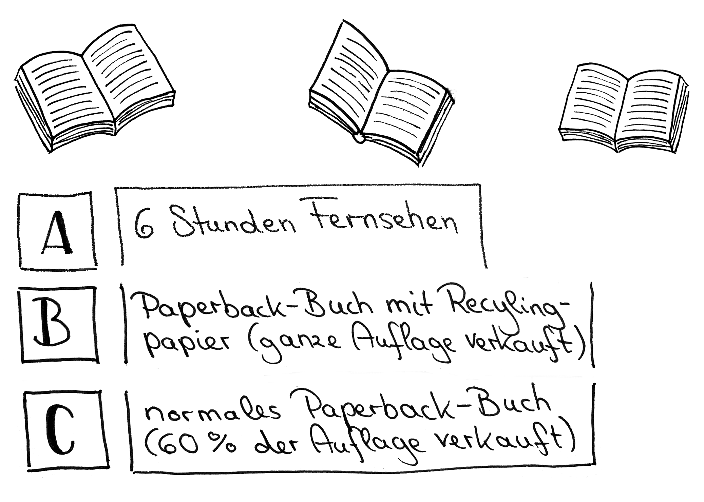
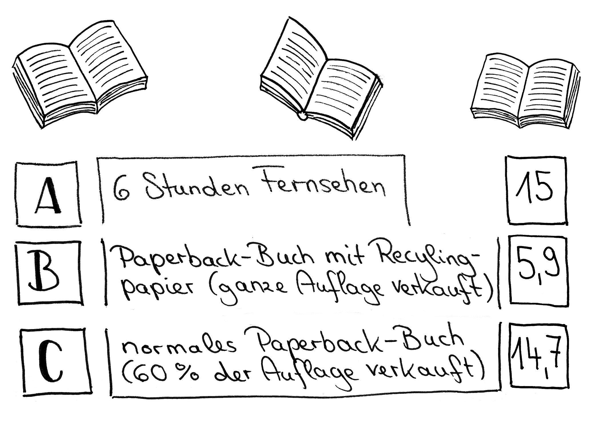

# Station 11: Bücherzelle  

<small>Addresse:<em style="margin-left: 10px">Bindergasse 11</em></small>

Mit welcher dieser Möglichkeiten verbringst du am liebsten deine Freizeit?
===+ "Auftrag"

    {: style="max-height:60vh" }

=== "Ergebnis"

    {: style="max-height:60vh" }

____

**[Weg zur nächsten Station](next_url)**

**Halte Ausschau nach:**

einer Brücke.