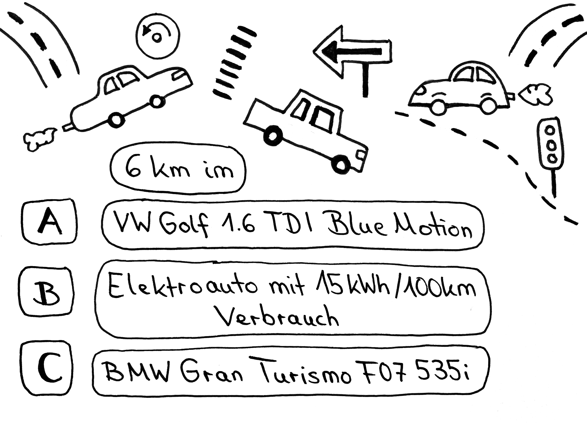
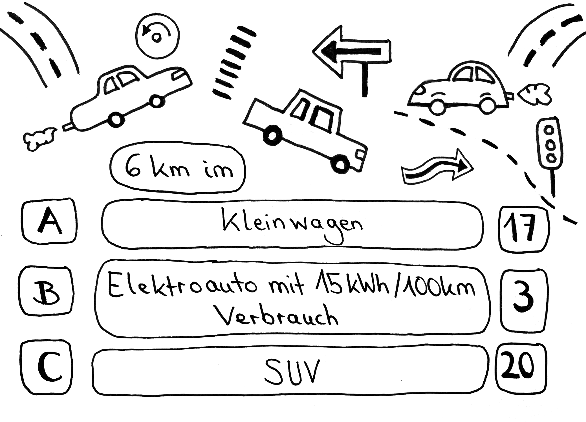

# Station 13b: Autos  

<small>Addresse:<em style="margin-left: 10px">Innsbrucker Bundesstraße 70</em></small>

Mit welchem Auto bist du am meisten unterwegs?
===+ "Auftrag"

    {: style="max-height:60vh" }

=== "Ergebnis"

    {: style="max-height:60vh" }

____

**[Weg zur nächsten Station](next_url)**

**Halte Ausschau nach:**

dem unübersehbaren Gebäudekomplex mit einem großen, schmiedeeisernen Tor zu deiner rechten Seite.