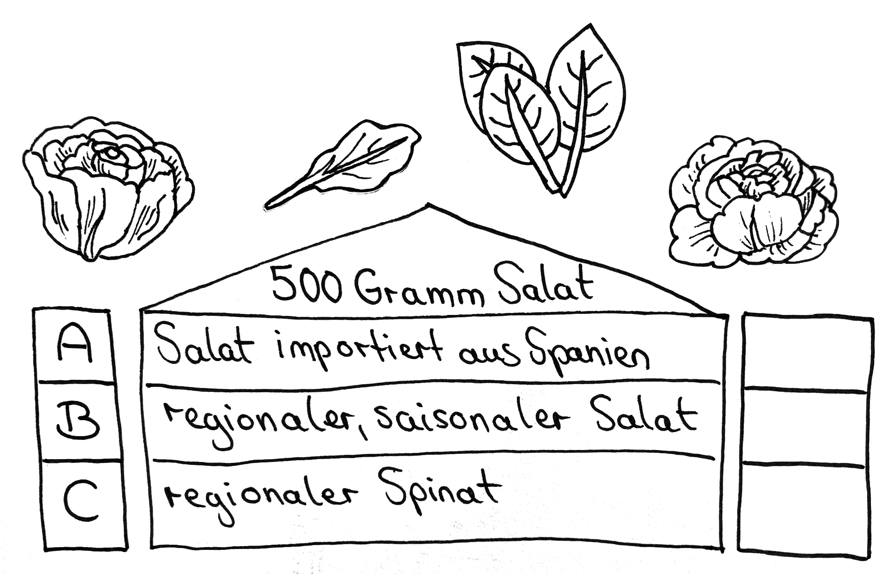

# Station 14: Bauernhof  

<small>Adresse:<em style="margin-left: 10px">Innsbrucker Bundesstraße 60</em></small>

Was würdest du auf der Schranne wählen?

  Zufallsentscheidung:

===+ "Auftrag" 

    {: style="max-height:60vh" }

=== "Ergebnis"

    {: style="max-height:60vh" }

Das Krailngut ist noch einer der wenigen Stadtbauernhöfe. Rechts siehst du den Bauernhof und links siehst du dazugehörige Felder.

____

**[Weg zur nächsten Station](https://www.google.com/maps/dir/?api=1&travelmode=walking&destination=47.8029991,13.017429)**

**Halte Ausschau nach:**

dem Beginn des schmalen Pfades. Ja genau, gleich hier neben dem Krailngut.