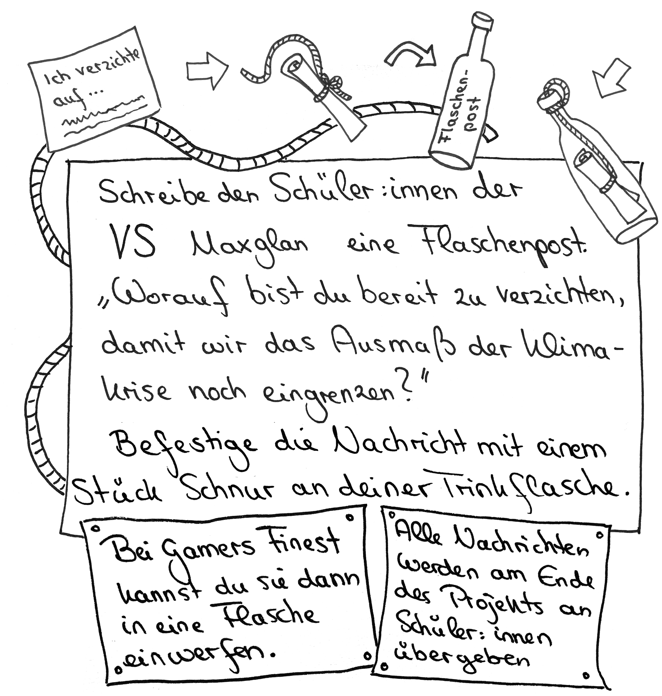

# Station 16: Flaschenpost  

<small>Addresse:<em style="margin-left: 10px">Michaelbeuernstraße 8</em></small>

{: style="max-height:60vh" }

[[installation_pic]]

____

**[Weg zur nächsten Station](https://www.google.com/maps/dir/?api=1&travelmode=walking&destination=47.8028333,13.0165242)**

**Halte Ausschau nach:**

ein paar bunt bemalten Holzstelzen zu deiner linken Seite.