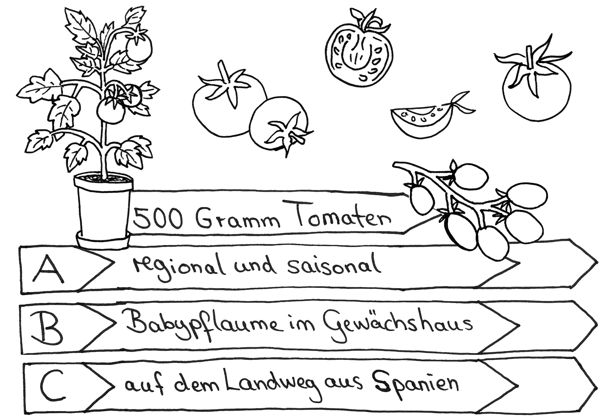
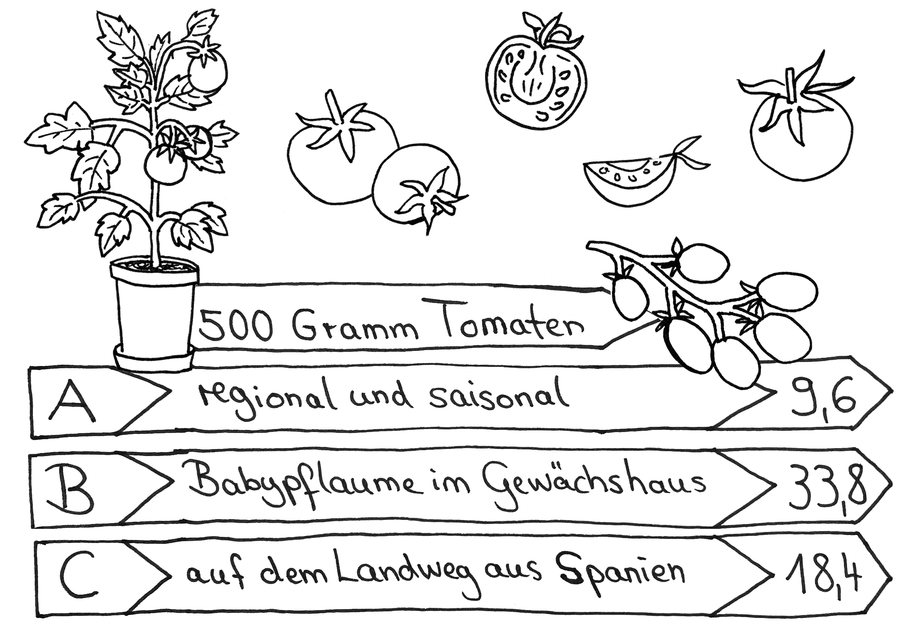

# Station 19: Gemüseanbau  

<small>Addresse:<em style="margin-left: 10px">Trautmannstraße 6</em></small>

Was wählst du am häufigsten, wenn du einkaufen gehst?
===+ "Auftrag"

    {: style="max-height:60vh" }

=== "Ergebnis"

    {: style="max-height:60vh" }

Würdest du die Möglichkeit nutzen, wenn du selbst an einem Ort wie diesem Gemüse anbauen könntest?

____

**[Weg zur nächsten Station](next_url)**

**Halte Ausschau nach:**

dem Garten des Hotels Max 70 auf deiner Linken Seite.