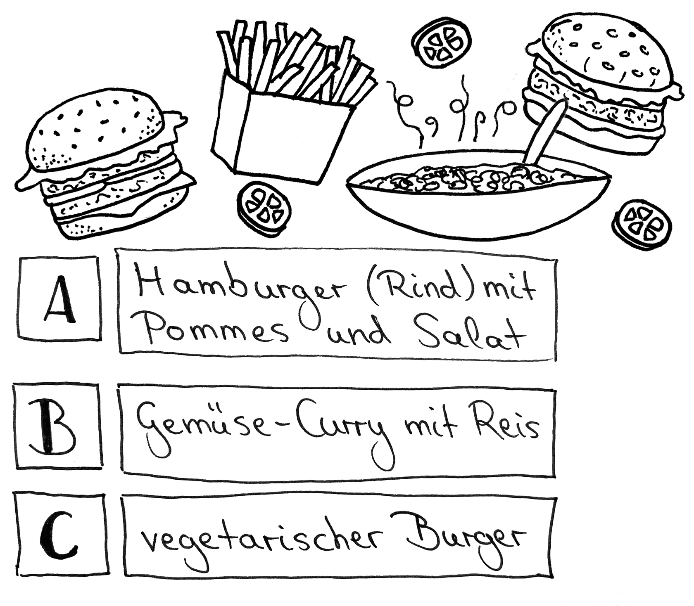
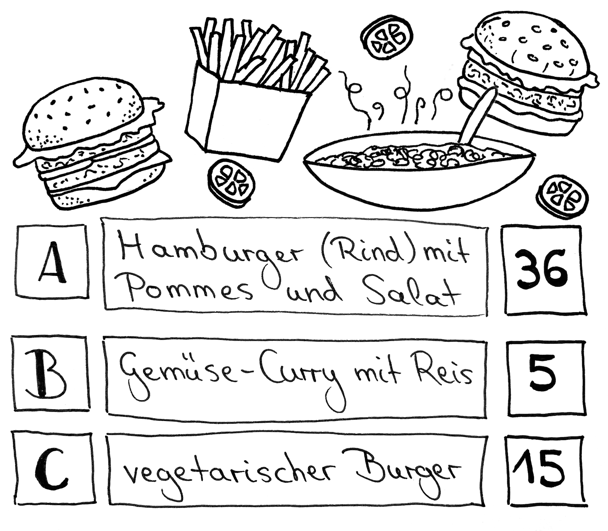

# Station 1b: Mittagessen  

<small>Addresse:<em style="margin-left: 10px">Sebastian-Stöllnerstraße 1</em></small>

Was darf es heute zu Essen geben?
Höre dir zuerst das Audio an, dann weißt du, was es mit der Zeichnung auf sich hat. Klicke vorher nicht auf „Ergebnis“.

<audio controls>
    <source src="https://github.com/kipppunkte/kipppunkte/raw/gh-pages/assets/1b_Mittagessen.mp3" type="audio/mpeg">
    Your browser does not support the audio tag.
</audio>

===+ "Auftrag"

    {: style="max-height:60vh" }

=== "Ergebnis"

    {: style="max-height:60vh" }

Hier die Erklärung zum Spiel-Auftrag zum Nachlesen:
In jeder Spielrunde werden dir drei Möglichkeit präsentiert, zwischen denen du dich entscheiden kannst. Oder du packst einfach deinen Würfel aus und lässt den Zufall entscheiden. 
Wenn du würfelst, entspricht jede Zahl einem Buchstaben:
1-2 = A
3-4 = B
5-6 = C
Bei jeder Antwort erhältst du ein Ergebnis an Punkten. Dafür klickst du rechts über dem Bild auf „Ergebnis“. Aber bitte immer erst nachdem du deine Entscheidung hast. Trage das Punkteergebnis immer in das jeweils entsprechende Feld auf deiner Stadtteilkarte ein.

Gehe, nachdem du deine Punkte für den Spielauftrag eingetragen hast, weiter zur Station 2 „Tischlerei“.

____

**[Weg zur nächsten Station](next_url)**

**Halte Ausschau nach:**

einem großen grünen Schild „Kunsttischlerei & Möbel-Restaurierungen“ oder dem kleinen Pumuckl.