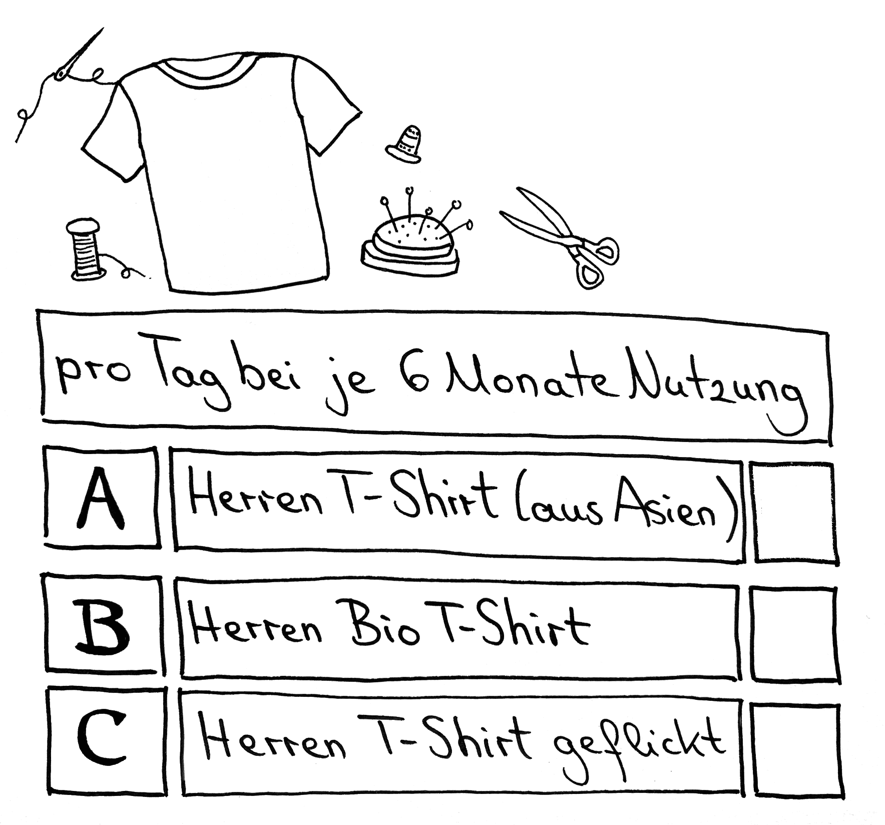

# Station 21: Schneiderei 

===+ "Auftrag"

    {: style="max-height:60vh" }

=== "Ergebnis"

    {: style="max-height:60vh" }

[Directions](https://www.google.com/maps/dir/?api=1&travelmode=walking&destination=47.7994242,13.0183928)