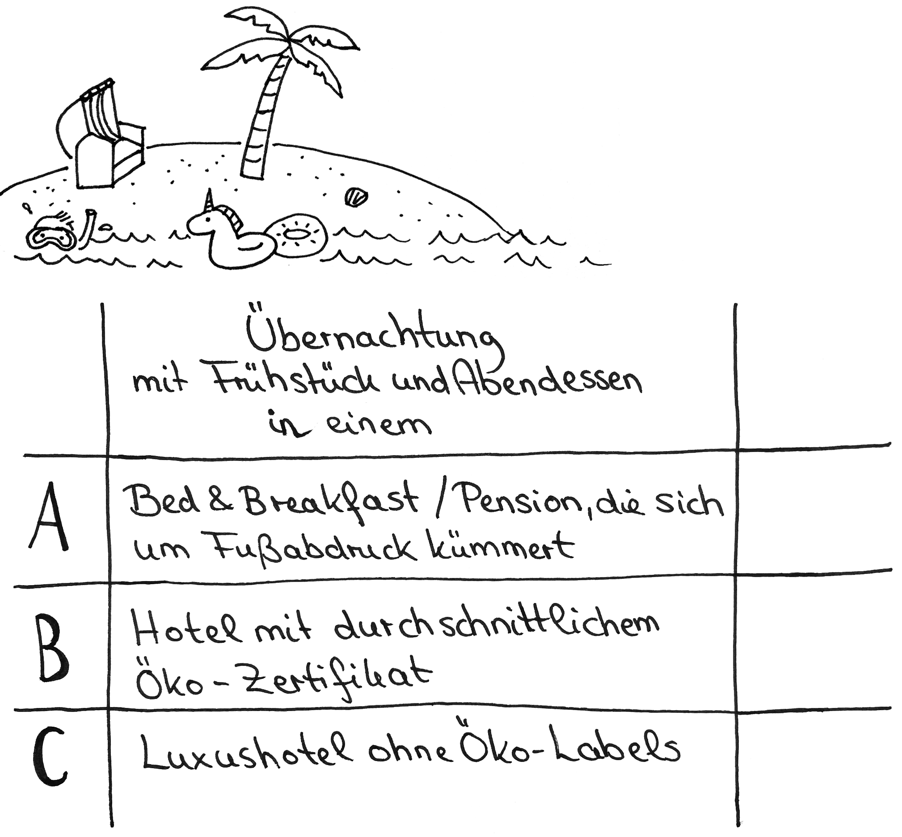
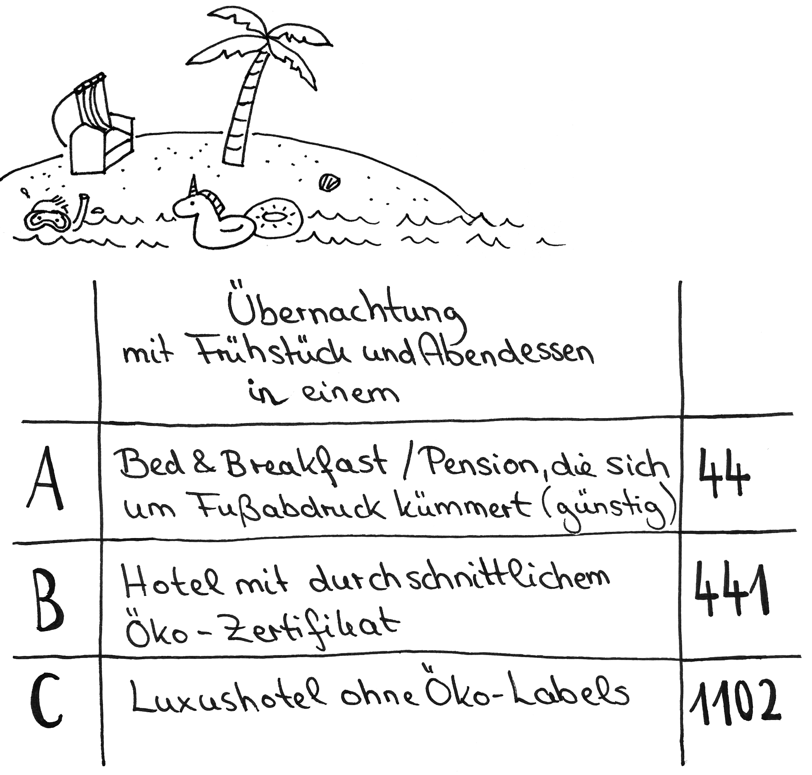

# Station 23: Hotel  

<small>Addresse:<em style="margin-left: 10px">Maxglaner Hauptstrasse 45</em></small>

In welcher Art von Hotel verbringst du deinen Traumurlaub am liebsten? Stell dir vor, du kannst eine Nacht spontan wählen. Welche Unterkunft wäre es?
===+ "Auftrag"

    {: style="max-height:60vh" }

=== "Ergebnis"

    {: style="max-height:60vh" }

Wir sind jetzt bei etwas mehr als der Hälfte des Weges angekommen. Solltest du für heute genug Input aufgesogen haben, oder der Weg dir zu lange werden, kannst du hier den Spaziergang für heute beenden. Du bist aber eingeladen, wenn du möchtest, schon die Endstation 39 bei Gamers Finest vorzuziehen, da es sich nur wenige Meter gerade aus von dir befindet.
Den zweiten Teil kannst du gerne auch an einem anderen Tag mit neuer Energie genießen.

____

**[Weg zur nächsten Station](https://www.google.com/maps/dir/?api=1&travelmode=walking&destination=47.7966933,13.019653)**

**Halte Ausschau nach:**

einem modernen Beton-Haus. Gehe an diesem gerade weiter und entdecke, den dazugehörigen Garten.