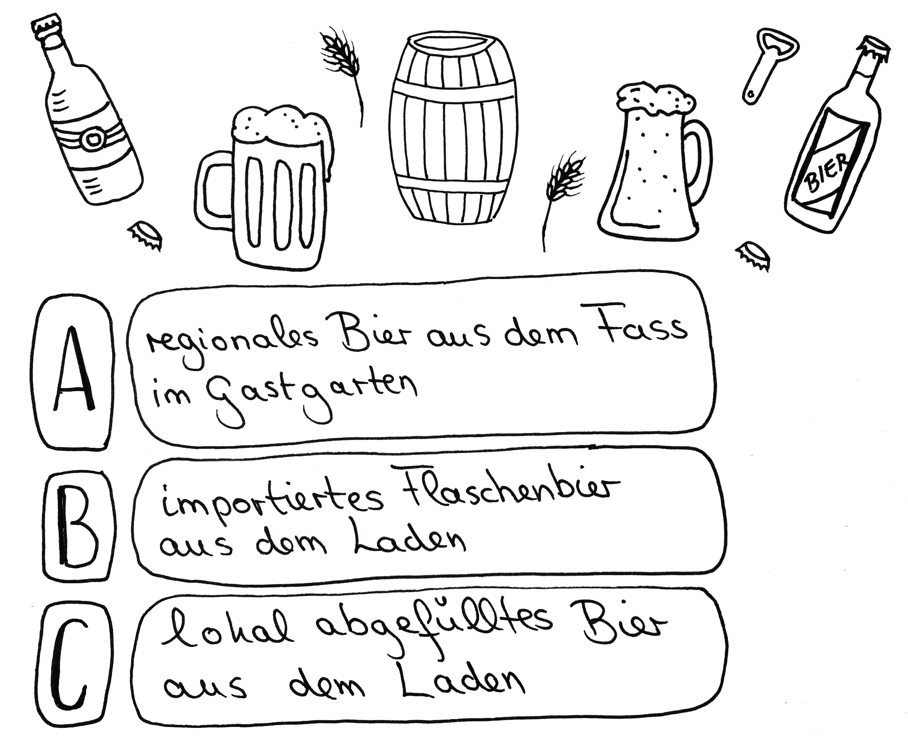
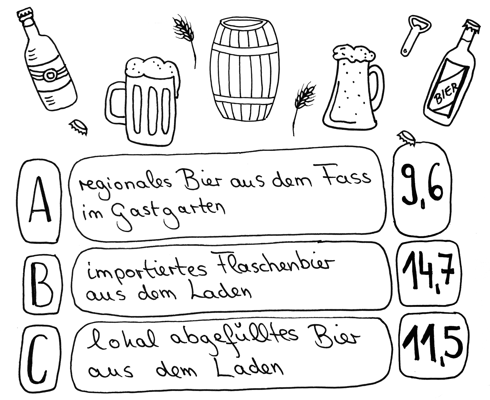

# Station 25: Bierbrauerei  

<small>Addresse:<em style="margin-left: 10px">Rochusgasse 17</em></small>

Wirf einen Blick auf die Stieglbrauerei. Lust auf ein Bier bekommen? Aber welches?
===+ "Auftrag"

    {: style="max-height:60vh" }

=== "Ergebnis"

    {: style="max-height:60vh" }

____

**[Weg zur nächsten Station](next_url)**

**Halte Ausschau nach:**

dem Gastgarten, wenn du nach links abbiegst.