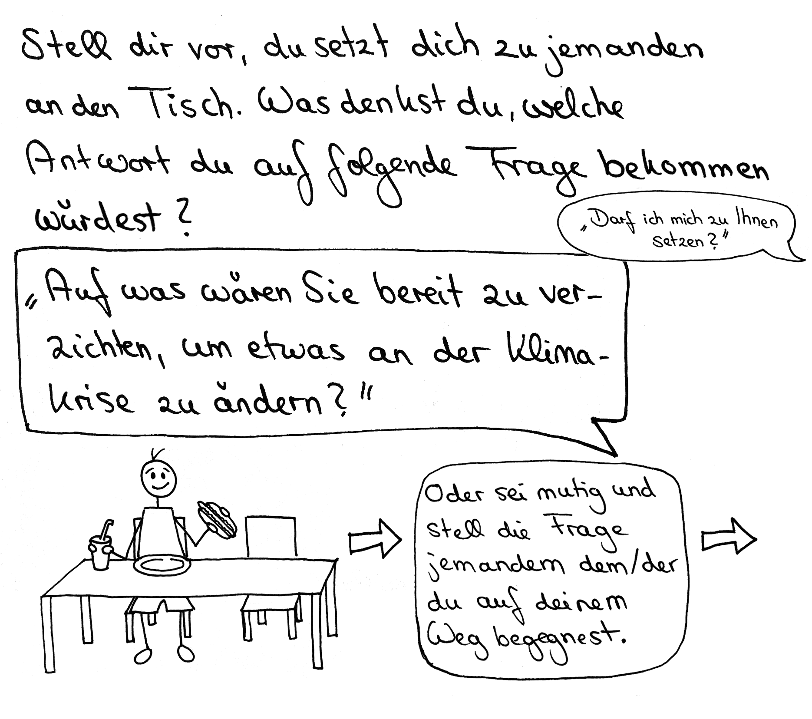

# Station 26: Gasthof  

<small>Adresse:<em style="margin-left: 10px">Rochusgasse 15</em></small>

Direkt nach dem Gebäude des Gasthofes ist ein kleiner Gastgarten. Blicke in diesen, während du deinen Auftrag  auf dich wirken lässt.

{: style="max-height:60vh" }

____

**[Weg zur nächsten Station](https://www.google.com/maps/dir/?api=1&travelmode=walking&destination=47.7961837,13.0209395)**

**Halte Ausschau nach:**

dem gelben großen Gebäude mit der Aufschrift „Rochushof“.