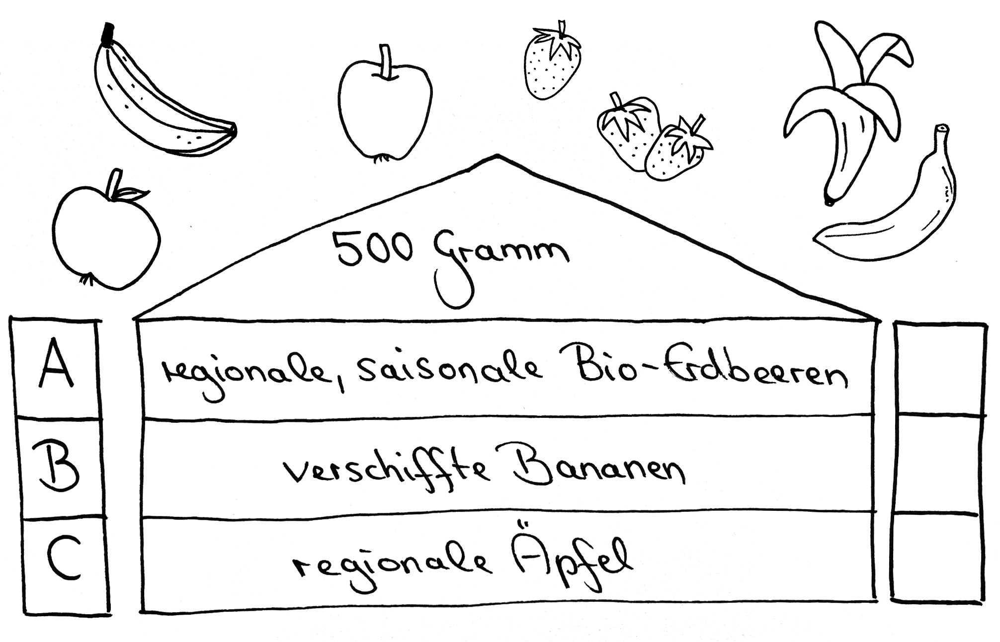
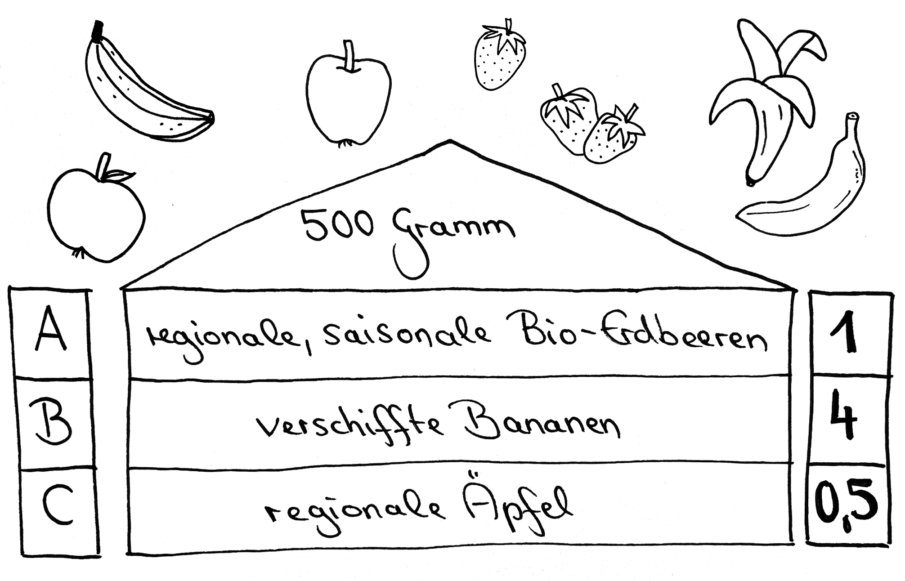

# Station 27: Ökohof  

<small>Adresse:<em style="margin-left: 10px">Rochusgasse 6</em></small>

Welches Obst ist du am liebsten?
===+ "Auftrag" 

    

    {: style="max-height:60vh" }

=== "Ergebnis"

    

    {: style="max-height:60vh" }

Vollende zuerst den Spielauftrag, bevor du das Audio anhörend weitergehst.

<audio controls>
    <source src="https://github.com/kipppunkte/kipppunkte/raw/gh-pages/assets/27_Ökohof.mp3" type="audio/mpeg">
    Your browser does not support the audio tag.
</audio>

____

**[Weg zur nächsten Station](https://www.google.com/maps/dir/?api=1&travelmode=walking&destination=47.7956509,13.0252697)**

**Halte Ausschau nach:**

einem gelben Haus mit grünen Fensterläden auf einer großen Grünfläche.