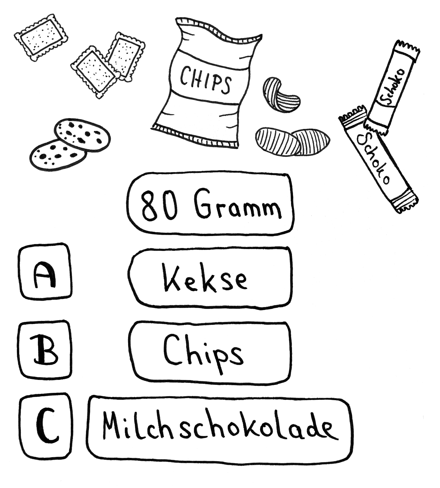
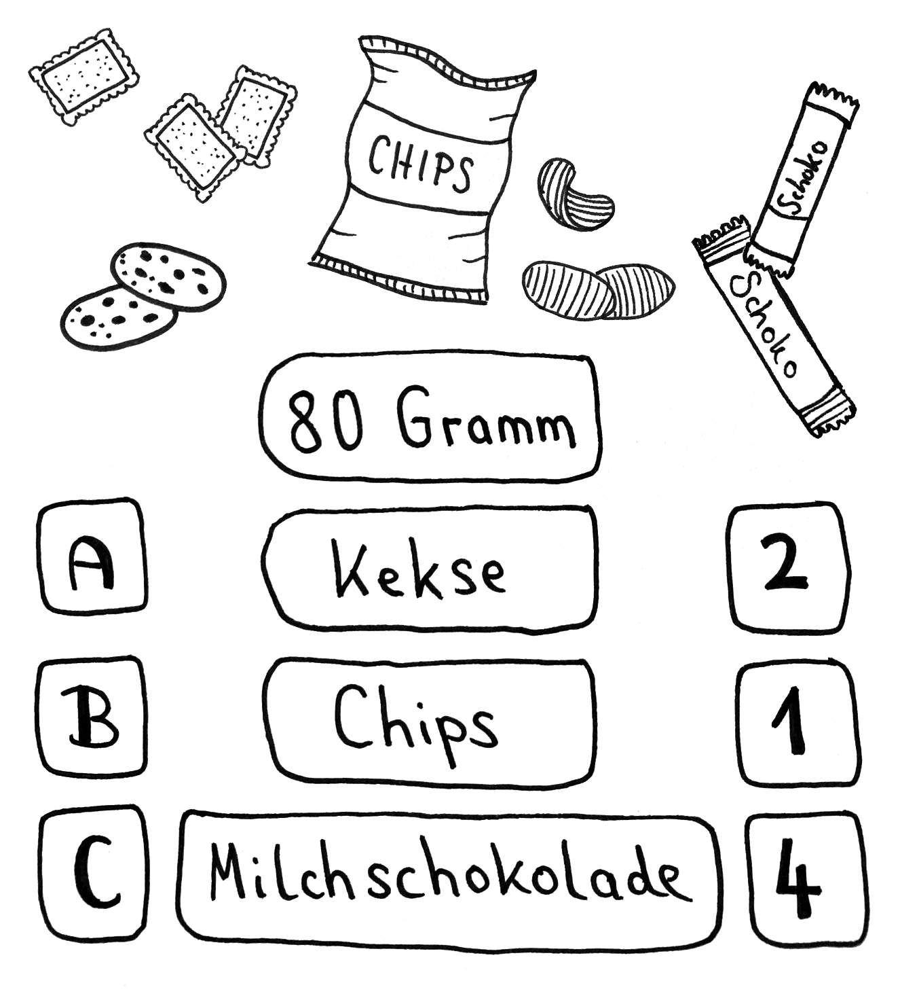

# Station 29: Snack-Automat  

<small>Adresse:<em style="margin-left: 10px">Maxglaner Hauptstraße 9</em></small>

Lust auf einen Snack bekommen? Was isst du am häufigsten?

  Zufallsentscheidung:

===+ "Auftrag" 

    {: style="max-height:60vh" }

=== "Ergebnis"

    {: style="max-height:60vh" }

Mittlerweile gibt es überall diese Automaten, an denen du 24-Stunden am Tag fast alles bekommst. Besonders an der Maxglaner Hauptstraße scheinen sie, wie Pilze aus dem Boden zu schießen. Wieviele fallen dir auf dem Weg bis zum Ende der Route auf?

____

**[Weg zur nächsten Station](https://www.google.com/maps/dir/?api=1&travelmode=walking&destination=47.7963696,13.0249757)**

**Halte Ausschau nach:**

dem Eingang des FIT.smartfood.