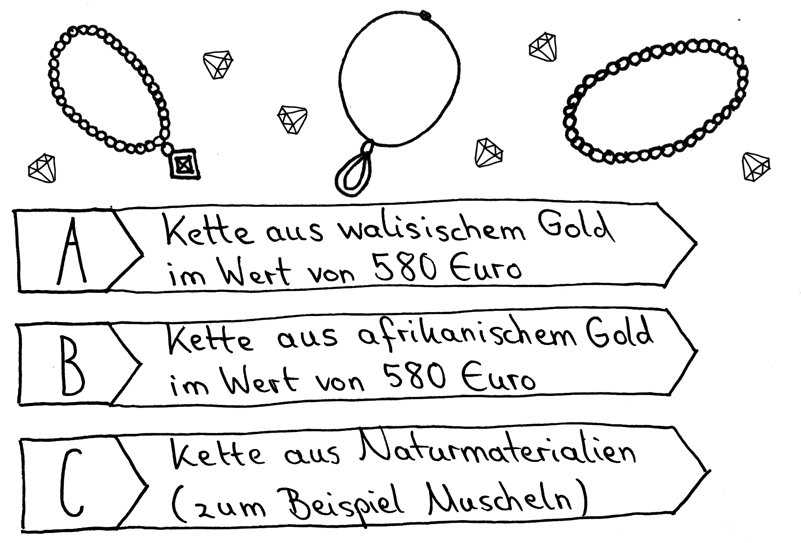
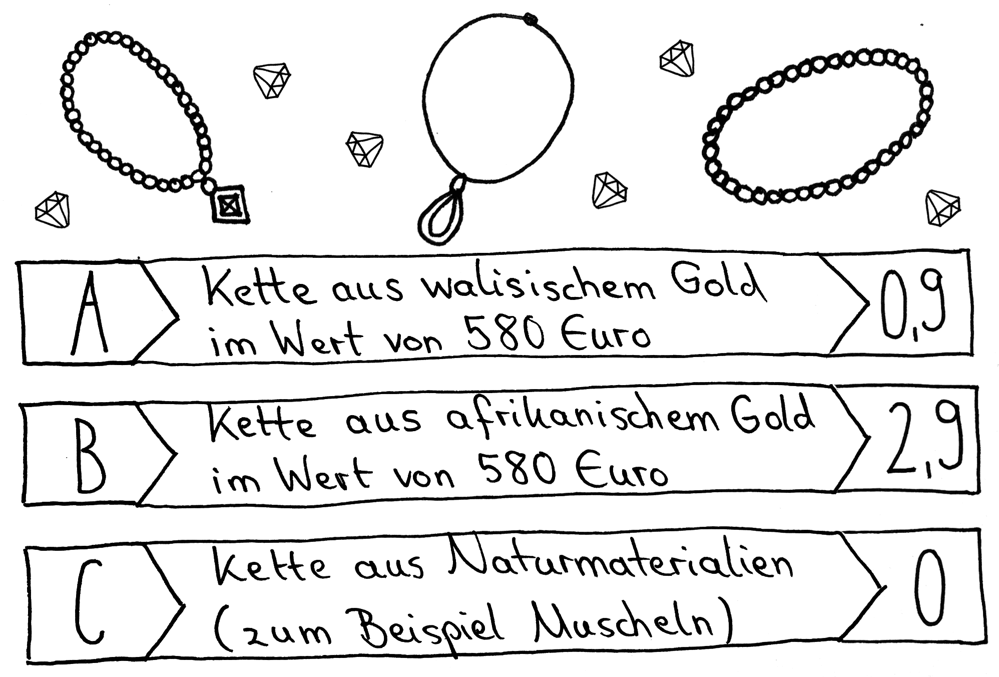

# Station 3: Schmuckatelier  

<small>Adresse:<em style="margin-left: 10px">Straubingerstraße 15</em></small>

Es wird Zeit für neuen Schmuck. Lass uns mal annehmen, dass du oder eine beschenkte Person diesen für umgerechnet 10 Jahre fast täglich tragt. Welcher Schmuck darf es sein?

  Zufallsentscheidung:

===+ "Auftrag" 

    {: style="max-height:60vh" }

=== "Ergebnis"

    {: style="max-height:60vh" }

____

**[Weg zur nächsten Station](https://www.google.com/maps/dir/?api=1&travelmode=walking&destination=47.7994124,13.0220549)**

**Halte Ausschau nach:**

einem Bach.