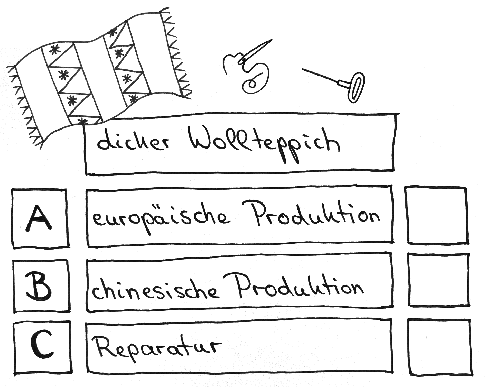
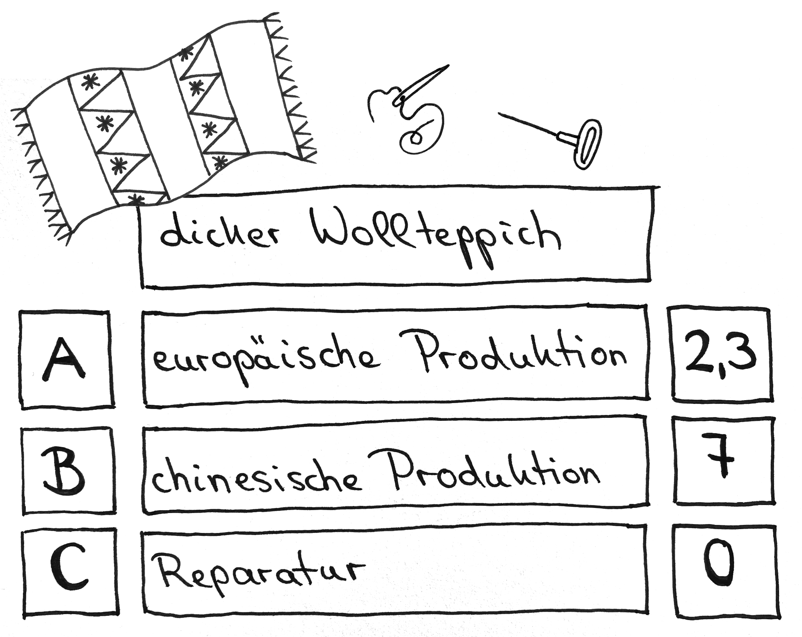

# Station 31: Teppichwerkstatt  

<small>Adresse:<em style="margin-left: 10px">Maxglaner Hauptstrasse 11</em></small>

  Zufallsentscheidung:

===+ "Auftrag" 

    {: style="max-height:60vh" }

=== "Ergebnis"

    {: style="max-height:60vh" }

Hast du schonmal einen gewebten Teppich reparieren lassen? Was hast du daheim?

____

**[Weg zur nächsten Station](https://www.google.com/maps/dir/?api=1&travelmode=walking&destination=47.7964293,13.0242518)**

**Halte Ausschau nach:**

dem „Asia Food“ Schild auf der linken Straßenseite. Vor dem Schaufenster stehst du richtig.