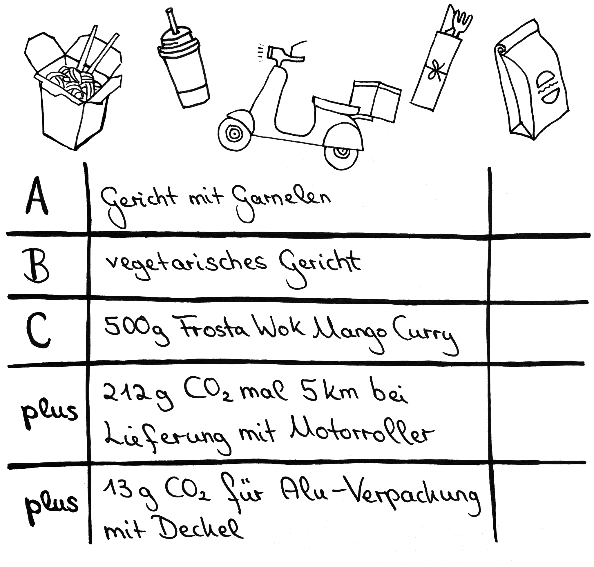
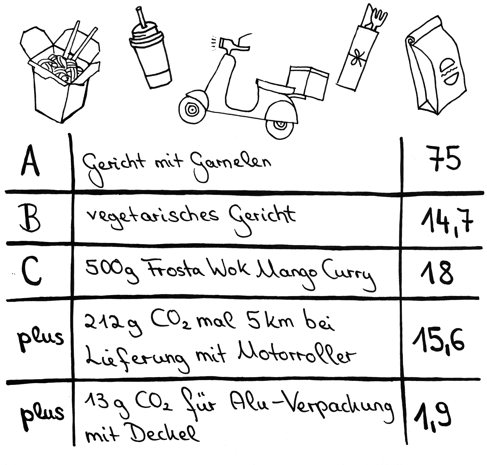

# Station 32: Lieferung  

<small>Addresse:<em style="margin-left: 10px">Maxglaner Hauptstraße 12</em></small>

Zum Abendessen haben wir leider keine Zeit mehr, gemütlich in ein Gasthaus einzukehren. Was lässt du dir liefern? Vergiss nicht die Punkte für Verpackung und Lieferung dazu zu rechnen. 
===+ "Auftrag"

    {: style="max-height:60vh" }

=== "Ergebnis"

    {: style="max-height:60vh" }

____

**[Weg zur nächsten Station](next_url)**

**Halte Ausschau nach:**

dem Schild „Björn Korell Bikes“.