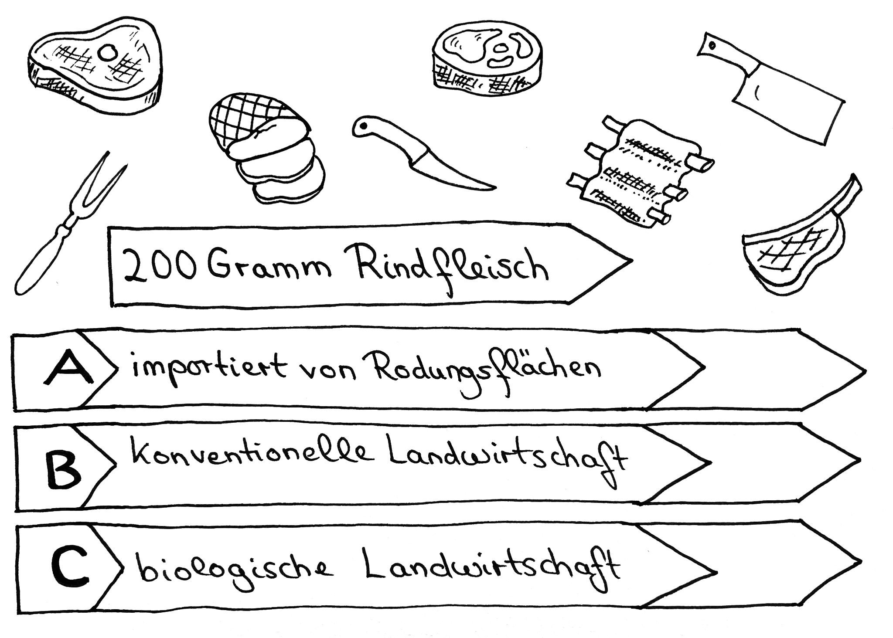
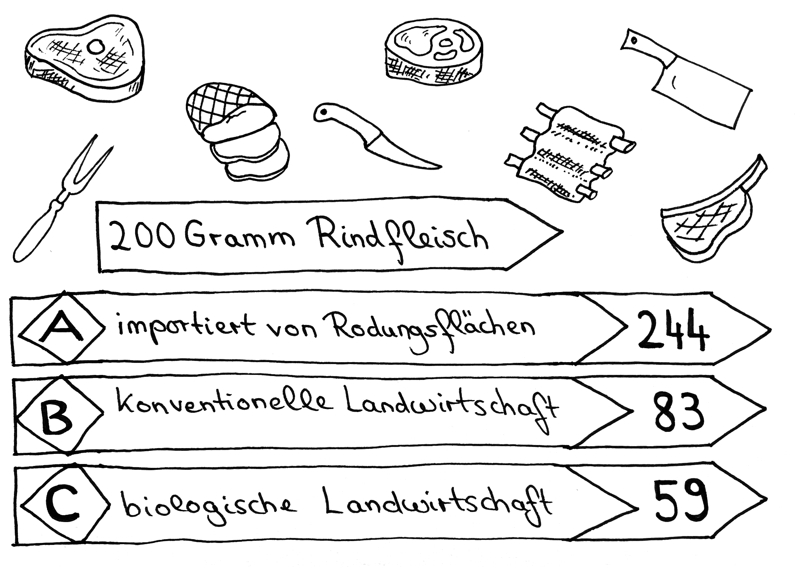

# Station 34: Fleischhauerei  

<small>Addresse:<em style="margin-left: 10px">Maxglaner Hauptstraße 14</em></small>

Welches Rindfleisch kaufst du in der Regel ein?
===+ "Auftrag"

    {: style="max-height:60vh" }

=== "Ergebnis"

    {: style="max-height:60vh" }

Maxglan hat noch einen Fleischhauer, der sein Fleisch selbst schlachtet und produziert. Und das alles regional.

____

**[Weg zur nächsten Station](next_url)**

**Halte Ausschau nach:**

220 Grad. Um dort hinzukommen, kannst du nun an der Ampel die Straße kreuzen.