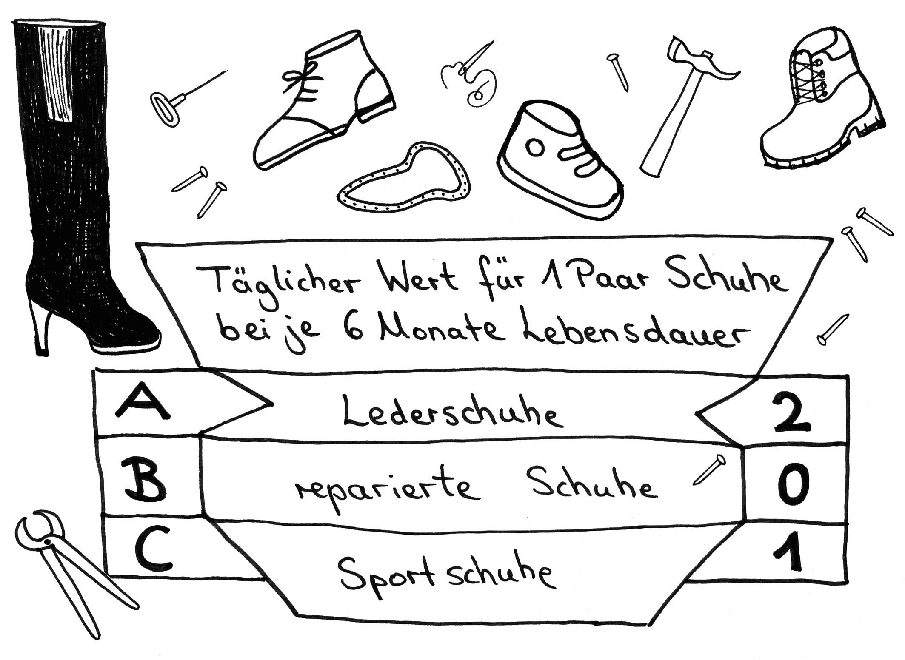

# Station 36: Schuhservice  

<small>Addresse:<em style="margin-left: 10px">Maxglaner Hauptstraße 26</em></small>

Welche Schuhe trägst du heute? Hast du sie vielleicht sogar schonmal reparieren lassen?
===+ "Auftrag"

    {: style="max-height:60vh" }

=== "Ergebnis"

    {: style="max-height:60vh" }

____

**[Weg zur nächsten Station](next_url)**

**Halte Ausschau nach:**

dem Laden gleich hier rechts an der Straßenecke, du musst also praktisch gar nicht weiter gehen.