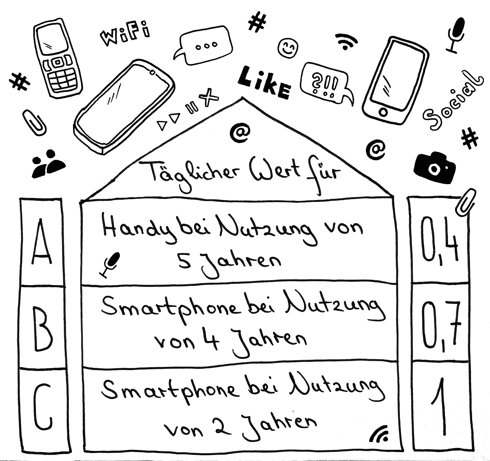

# Station 37: Handydoktor  

<small>Addresse:<em style="margin-left: 10px">Maxglaner Hauptstraße 31</em></small>

Auf das Handy verzichten? Das machen die wenigsten. Auch dieses Projekt funktioniert nicht ohne. Denn ohne Technik wäre vieles nicht möglich. 
Wie lange behältst du dein Handy in der Regel?
===+ "Auftrag"

    {: style="max-height:60vh" }

=== "Ergebnis"

    {: style="max-height:60vh" }

____

**[Weg zur nächsten Station](https://www.google.com/maps/dir/?api=1&travelmode=walking&destination=13.0219978,47.7972473)**

**Halte Ausschau nach:**

Der Bäckerei nur wenige Schritte weiter zu deiner Rechten.