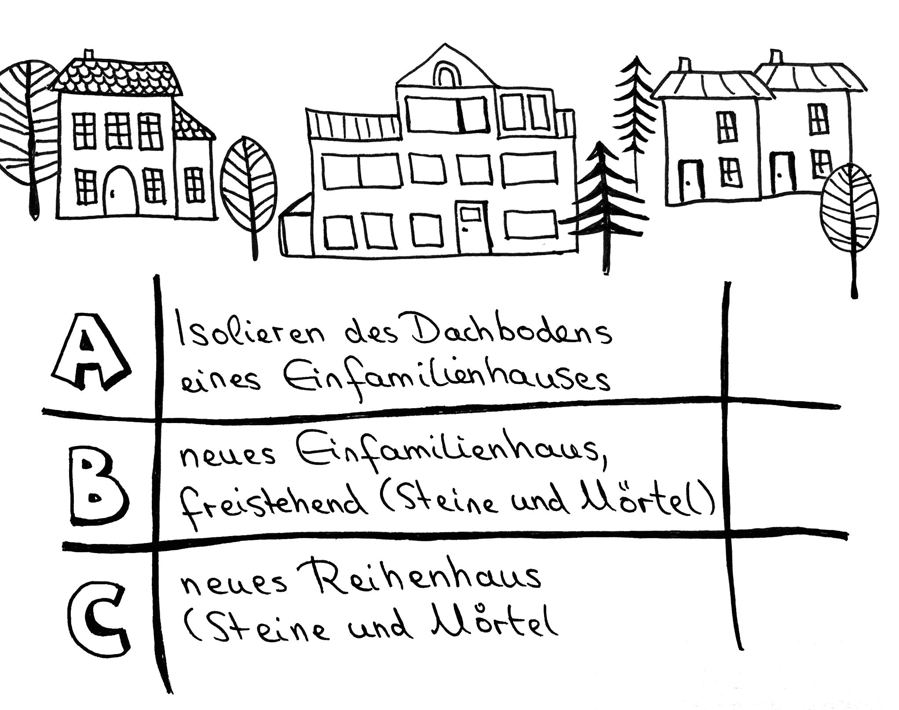
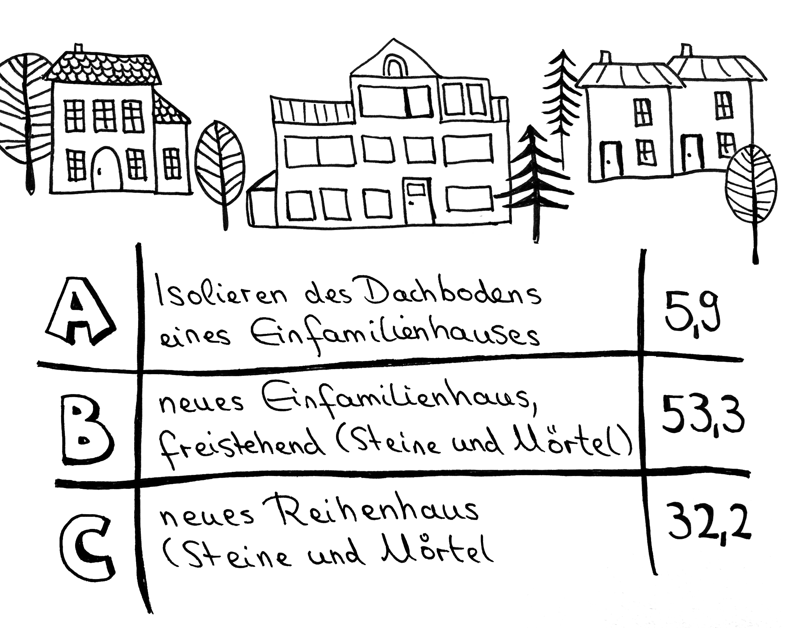

# Station 6b: Bauprojekt  

<small>Addresse:<em style="margin-left: 10px">Ganshofstraße 32</em></small>

Wenn wir schon beim Traum vom Wohnen sind: Welche Variante darf es für dich als Zuhause sein?
===+ "Auftrag"

    {: style="max-height:60vh" }

=== "Ergebnis"

    {: style="max-height:60vh" }

____

**[Weg zur nächsten Station](https://www.google.com/maps/dir/?api=1&travelmode=walking&destination=13.0202449,47.8013649)**

**Halte Ausschau nach:**

einem rosa Haus mit Turm.